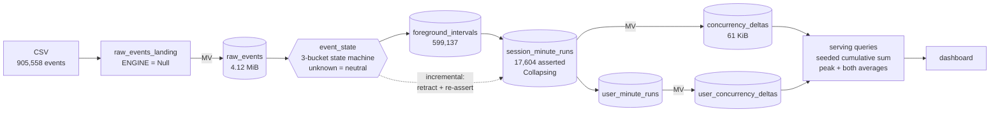

# phoenix-concurrency

**Team: The Phoenix** · ClickHouse Click-a-thon 2026 · SonyLIV track

## The problem

Design a scalable concurrency computation model on top of one or more aggregated tables
(session-aware or session-independent) that uses session start/end along with heartbeat or
active-state signals to count only **truly active** playback intervals, excluding backgrounded
periods, while remaining query-efficient and update-friendly at very large scale.

Counting overlapping sessions overstates the audience: a session can be open while the app is
backgrounded, the player is paused, or the heartbeat has stopped arriving. The unit of truth is
the active interval inside the session, not the session.

Constraints that shape every decision:

- **ClickHouse is the primary datastore and engine.** Ingestion, modelling, and all concurrency
  computation live there.
- **Peak is per dimension combination.** A platform slice and a platform+country slice peak at
  different minutes inside the same range.
- **Update-friendly.** Open sessions keep growing as heartbeats land, and late events arrive
  after the fact. Absorbing them must be incremental, never a rebuild.
- **Must meaningfully integrate one of** ClickStack, Langfuse, or LibreChat.
- **The unseen day.** A fresh day of data drops in the final hours. Reloading is one command
  (`./scripts/load.sh <file> <table>`), not an improvised pipeline at hour 22.

Full statement: [`docs/problem/PROBLEM_STATEMENT.md`](docs/problem/PROBLEM_STATEMENT.md).
Data dictionary: [`docs/problem/dataset_details.md`](docs/problem/dataset_details.md).

## Architecture

Events become foreground intervals, intervals merge into per-session minute runs, runs emit
`+1` / `-1` deltas, and a cumulative sum over the deltas is the concurrency curve. Cost tracks
interval boundaries rather than watch time, so a three-hour session costs the same two rows as
a two-minute one, and 232 MB of CSV becomes a **61 KiB** serving table.



Full reasoning, with the measured cost of every choice, in
[`docs/problem/DESIGN.md`](docs/problem/DESIGN.md). Table-by-table detail in
[`docs/DATA_MODEL.md`](docs/DATA_MODEL.md).

### Proven numbers

Each links to a command and an artifact via [`evidence/LEDGER.tsv`](evidence/LEDGER.tsv).
Nothing here is quoted from memory.

| Claim | Number | Reproduce |
|---|---|---|
| Peak concurrent sessions | 2,829 at 2026-07-26 10:56 | `./scripts/ground_state.sh` |
| Naive session-span counting overstates peak by | **32.3 percent** | `./scripts/naive_baseline.sh` |
| Minutes where naive invents an audience | 1,592 | `./scripts/naive_baseline.sh` |
| Serving vs brute-force oracle | 3,664 minutes, **0 diffs** | `./scripts/parity.sh` |
| Open sessions absorbed incrementally | 5,316 minutes, **0 diffs** | `./scripts/test_open_sessions.sh 30` |
| Unfiltered query reads | 26,904 rows in 10 ms | `./scripts/bench.sh` |
| Platform filter prunes to | 16,384 rows, 2/4 granules | `./scripts/bench.sh` |
| Full rebuild, CSV to verified serving layer | **70 seconds** | `./scripts/rehearse_runbook.sh` |
| Data-quality invariants | 6 of 6 at required value | `./scripts/ground_state.sh` |

## Documentation

| Start here | |
|---|---|
| [`docs/STATUS.md`](docs/STATUS.md) | **Open this first.** Done, in flight, not started, owners |
| [`docs/GROUND_STATE.md`](docs/GROUND_STATE.md) | What is actually on the server, measured |
| [`docs/DATA_MODEL.md`](docs/DATA_MODEL.md) | Every table: purpose, key, cost, invariants |
| [`docs/database_details.md`](docs/database_details.md) | Physical reference, plus the ClickHouse best-practice audit |
| [`docs/problem/DESIGN.md`](docs/problem/DESIGN.md) | Decisions, trade-offs, the filter-shape read table |
| [`docs/corrections.md`](docs/corrections.md) | Numbers we published wrong, and what caught them |
| [`docs/RUNBOOK_UNSEEN_DAY.md`](docs/RUNBOOK_UNSEEN_DAY.md) | Exact steps for the sealed drop, rehearsed |
| [`evidence/LEDGER.tsv`](evidence/LEDGER.tsv) | Any claim to the command that produced it, in one hop |
| [`docs/issues/`](docs/issues/) | Findings on ingest, which is a teammate's and untouched |

## Layout

```
docs/problem/   problem statement + data dictionary (given, do not edit)
docs/           assumptions.md, the living decision log
sql/schema/     DDL, one file per table
sql/queries/    benchmark and validation queries
scripts/        load.sh (CSV -> ClickHouse), profile.sh (dataset facts)
demo/           single-file vanilla JS dashboard (no build step)
frontend/       Next.js (App Router, TypeScript) dashboard, see frontend/README.md
pitch/          slides and demo notes
data/           gitignored, the CSVs never enter version control
```

## Getting started

```bash
cp .env.example .env      # fill in from the ClickHouse Cloud console
cp /path/to/*.csv data/
./scripts/profile.sh data/ch-hackathon-raw-data.csv    # columns, row count, event types, span
./scripts/load.sh data/ch-hackathon-raw-data.csv raw_events
git status --short        # must never show a .csv
```

Needs the `clickhouse` binary on PATH (`curl https://clickhouse.com/ | sh`). Nothing else.

## The service

ClickHouse Cloud, `ap-south-1`, database `phoenix`. Credentials live in `.env`, never in git.

```bash
./scripts/init_db.sh                                        # database + every DDL in sql/schema
./scripts/load.sh data/ch-hackathon-content-data.csv content
./scripts/load.sh data/ch-hackathon-raw-data.csv raw_events_landing
./scripts/ch.sh --query "SELECT count() FROM raw_events"    # ad-hoc queries, UTC pinned
```

Loaded: 905,558 events over 10,866 sessions and 9,618 users, 2026-07-14 15:43 to
2026-07-26 11:30 UTC, plus 33,464 content rows. 232 MB of CSV compresses to 3.76 MiB on disk.
