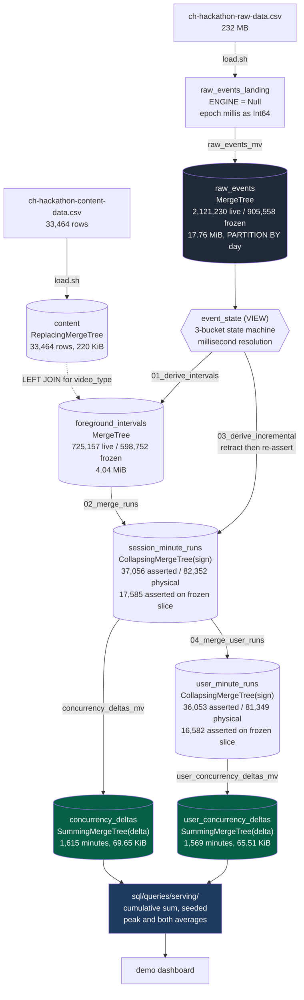

# Database details

**The ClickHouse Cloud service behind this project, as it actually exists.**
Server `26.2.1.525`, primary database `phoenix`. Structural facts read live from
`system.tables`, `system.columns` and `system.parts` on 2026-08-01, not from the files in
`sql/`: those have drifted from the live server before and cost a day.

**Regenerated 2026-08-01 after a Cloud cleanup.** Seven scratch databases and three
test-scaffolding tables inside `phoenix` were dropped, taking the service from nine databases to
two. Every figure below was re-read after that, so this file describes the service as it stands
rather than as it accumulated. What was removed and why is in
[the databases section](#the-databases-on-this-service).

This document is meant to be readable on its own. If you want the field-by-field business
meaning of the two source CSVs, that is [`problem/dataset_details.md`](problem/dataset_details.md).
If you want only the reasoning narrative without the physical reference,
[`DATA_MODEL.md`](DATA_MODEL.md) is shorter. Everything needed to understand what is in the
database and why it is shaped that way is below.

## Two sets of numbers, and which one you are reading

Live ingest keeps writing into `phoenix.raw_events` while we work. So every count exists twice:

| | Meaning | Stable? |
|---|---|---|
| **Live** | the whole table, right now | no, it grows every minute |
| **Frozen slice** | `event_timestamp < 2026-08-01` | yes, this is the validated corpus |

Every validation and benchmark figure in this repo is on the **frozen slice**. Live figures are
quoted below only to describe physical storage (parts, bytes), and they carry the timestamp of
the read. That is why a row count here can differ from the same table's count in
`DATA_MODEL.md`: at the read below, `raw_events` held **2,121,230 live rows** of which
**905,558 are frozen**, spanning `2026-07-14 15:43:58.144` to `2026-08-01 16:53:48.630`,
across 109,258 live sessions and 108,010 live users.

Contrast those live session and user counts with the frozen slice's **10,866 sessions and 9,618
users**, and the reason the freeze predicate is not optional becomes arithmetic rather than
argument: the live stream has added an order of magnitude more session ids than the validated
corpus contains. Any figure quoted without the predicate is a figure about the replay, not about
the dataset we were given.

The freeze predicate is `event_timestamp < {frozen_before:String}`, injected into every query by
`scripts/ch.sh`. It is deliberately **not** `ingested_at`. `ingested_at` was added by a later
`ALTER`; ClickHouse does not rewrite existing parts, so for pre-`ALTER` rows the `DEFAULT now()`
is evaluated at **read** time and the column equals the reading query's wall clock. Filtering on
it erases the entire validated corpus and keeps only the live rows, the exact inversion of what
was wanted. `[V:ingested_at_nondeterminism]`

## Connecting

Credentials live in `.env`, which is gitignored. Copy `.env.example` and fill it in from the
ClickHouse Cloud console:

```
CH_HOST=xxxx.region.clickhouse.cloud
CH_PORT=9440
CH_USER=default
CH_PASSWORD=
CH_DATABASE=phoenix
```

Nothing talks to the service directly. `scripts/ch.sh` is the only entrypoint, and it does three
things nobody should have to remember:

```bash
./scripts/ch.sh --query "SELECT 1"
./scripts/ch.sh --queries-file sql/schema/01_raw_events.sql
CH_DATABASE=phoenix_unseen ./scripts/ch.sh --query "SHOW TABLES"
FROZEN_BEFORE=2026-08-02 ./scripts/ground_state.sh
```

1. Injects `--param_frozen_before` (default `2026-08-01`), unless the caller passed it explicitly.
   The frozen slice is **one variable**, not a literal scattered through the SQL tree.
2. Pins `--session_timezone UTC`. Local runs are Asia/Kolkata and the service is UTC. Pinning both
   ends removes an entire class of off-by-five-and-a-half-hours.
3. Lets a caller-set `CH_DATABASE` win over `.env`, which is what makes one database per dataset
   generation cheap.

Creating and loading:

```bash
./scripts/init_db.sh                                    # applies sql/schema/*.sql to $CH_DATABASE
./scripts/init_db.sh phoenix_unseen                     # a fresh database for a new generation
./scripts/load.sh --dry-run data/some.csv               # DESCRIBE + count via clickhouse local
./scripts/load.sh data/some.csv raw_events_landing phoenix_unseen
```

`load.sh` compares source rows against loaded rows on every run. A CSV that loses rows to a
quoting error loads without complaint, and the loss stays invisible until a number is wrong much
later.

## The databases on this service

Two, as of the 2026-08-01 cleanup:

```
phoenix        the real one: validated corpus + live ingest  12 tables, 27.60 MiB
phoenix_next   generation-2 replica carrying the insight layer
```

Plus the ClickHouse-supplied `system`, `information_schema`, `INFORMATION_SCHEMA`, and `default` (ClickStack's OpenTelemetry schema).

`phoenix` now holds **exactly** the 12 objects `sql/schema/` defines, with nothing else. That was
not true before the cleanup, and the discrepancy is worth naming because it is the failure mode this
section exists to prevent: a live database that has drifted from its own versioned DDL.

### What was removed, and why none of it needed keeping

Seven scratch databases, roughly 26 MiB. Every one is **self-healing**: the script that owns it
begins with `DROP DATABASE IF EXISTS` and rebuilds it, so a dropped scratch database is a cache
miss rather than a loss.

| Dropped | Recreated by |
|---|---|
| `phoenix_parity_incr` | `scripts/parity.sh` |
| `phoenix_scratch_rehearsal` | `scripts/rehearse_runbook.sh` |
| `phoenix_scratch_openday` | `scripts/open_session_demo.sh` |
| `phoenix_open_test`, `phoenix_open_truth` | `scripts/test_open_sessions.sh` |
| `phoenix_scratch_keyorder` | `scripts/key_order_experiment.sh` |
| `phoenix_next` | `scripts/rebuild_swap.sh`, since renamed `phoenix_rebuild` (D9 amendment) |

**The name `phoenix_next` has since been reassigned.** It is now the generation-2 database: a
replica of `phoenix` carrying the insight layer, durable rather than scratch. `rebuild_swap.sh`
drops its shadow twice per run, so its default moved to `phoenix_rebuild` before the two could
collide. Anything below describing `phoenix_next` as a scratch database is history.

`phoenix_next` was the odd one out and got an explicit decision rather than a sweep.
`rebuild_swap.sh --keep-shadow` leaves the **previous** derived tables there after a swap, so it
was the one-command rollback for decision D8. It was dropped once parity passed 4 of 4 and
idempotence passed 5 of 5 on the new tables, on the grounds that
`git revert dc0d374 && ./scripts/rebuild_swap.sh` reproduces the old state in 90 seconds
`[V:runbook_rehearsal]`. A rollback that needs a 90-second command is still a rollback.

Three tables were also dropped from **inside `phoenix`**, which matters more than the scratch
databases because they were test scaffolding living in production and absent from `sql/schema/`, so
a fresh `init_db.sh` would never have created them:

| Dropped from `phoenix` | Was | Recreated by |
|---|---|---|
| `concurrency_deltas_naive` | 15,725 rows, the deliberately wrong session-span baseline | `scripts/naive_baseline.sh`, `CREATE TABLE IF NOT EXISTS` then `TRUNCATE` |
| `open_test_sessions` | 30 rows, open-session fixture | `scripts/test_open_sessions.sh`, `CREATE OR REPLACE TABLE` |
| `open_test_bystanders` | 200 rows, sessions that must not move | `scripts/test_open_sessions.sh`, `CREATE OR REPLACE TABLE` |

The evidence artifacts those tables produced are unaffected: they live in `evidence/` and are cited
from `LEDGER.tsv`, which is the whole point of writing findings to files instead of leaving them in
a database.

**One database per dataset generation still holds** as the rule for anything new. The cleanup
removed spent scratch, not the convention.

This is the structural replacement for the social rule
"announce your DDL", which has now failed twice: an out-of-band `ALTER` added a column to a table
mid-run and cost a day. It also makes the unseen day two commands

```bash
./scripts/init_db.sh phoenix_unseen
./scripts/load.sh data/unseen.csv raw_events_landing phoenix_unseen
```

rather than an improvised pipeline at hour 22. The full sequence is
[`RUNBOOK_UNSEEN_DAY.md`](RUNBOOK_UNSEEN_DAY.md), rehearsed end to end with per-step wall clock
`[V:runbook_rehearsal]`.

`phoenix_parity_incr` deserves a note even though it no longer exists between runs: `parity.sh`
rebuilds it from scratch every time, as the same schema built entirely by the incremental path
(`03_derive_incremental.sql`) rather than the batch path, so `foreground_intervals` is empty in it
**by design**. Diffing its serving output against `phoenix` is how we know the two paths agree
`[V:oracle_parity]`. It is transient on purpose: a parity database that survived between runs could
be compared against a `phoenix` it was never derived alongside.

**Every engine is a Cloud `Shared*` variant.** The DDL in `sql/schema/` says `MergeTree`,
`SummingMergeTree`, `CollapsingMergeTree`; ClickHouse Cloud substitutes `SharedMergeTree` and
friends, backed by shared object storage with a `/clickhouse/tables/{uuid}/{shard}` path and a
`{replica}` macro. Semantics are the same. It surprises people reading `SHOW CREATE TABLE` for
the first time, which is the only reason it is mentioned.

## Dataflow



The shape to notice: **the pipeline narrows by three orders of magnitude.** Two million events become
a 70 KiB serving table, because cost tracks interval boundaries rather than watch time. A three-hour
session costs the same two delta rows as a two-minute one, which is why the serving table grew by
only 9 KiB while `raw_events` more than doubled.

## Object reference

**Twelve objects in `phoenix`**, in pipeline order, and that is now exactly the set `sql/schema/`
defines. Sizes are compressed unless stated; parts are active parts at the 2026-08-01 read, taken
after the cleanup.

### `raw_events_landing`

**Engine.** `Null`. It stores nothing. Rows inserted into it are handed to the attached
materialized view and discarded.

**Why it exists.** The CSV carries `event_timestamp` and `session_start_epoch` as **epoch
milliseconds**, which is an `Int64`, not a timestamp. The landing table accepts the file exactly
as delivered and the view does the conversion, so the load is `INSERT ... FORMAT CSVWithNames`
with no preprocessing step to get wrong on the unseen day.

| Column | Type |
|---|---|
| `content_id` | `Int64` |
| `video_session_id` | `String` |
| `user_id` | `String` |
| `event_type` | `LowCardinality(String)` |
| `event` | `LowCardinality(String)` |
| `event_timestamp` | `Int64` (epoch millis) |
| `platform` | `LowCardinality(String)` |
| `app_version` | `LowCardinality(String)` |
| `country` | `LowCardinality(String)` |
| `audio_language` | `LowCardinality(String)` |
| `subtitle_language` | `LowCardinality(String)` |
| `player_version` | `LowCardinality(String)` |
| `session_start_epoch` | `Int64` (epoch millis) |

Column order matches the CSV header, which is why `content_id` leads here and not in `raw_events`.

**Written by.** `scripts/load.sh`. **Read by.** `raw_events_mv` only.

### `raw_events_mv`

**Engine.** `MaterializedView`, `raw_events_landing` to `raw_events`.

```sql
SELECT video_session_id, user_id, content_id, event_type, event,
       fromUnixTimestamp64Milli(event_timestamp) AS event_timestamp,
       platform, app_version, country, audio_language, subtitle_language, player_version,
       fromUnixTimestamp64Milli(session_start_epoch) AS session_start_epoch
FROM phoenix.raw_events_landing
```

Millis to `DateTime64(3)`, nothing else. No filtering, no dropping: whatever arrives is stored.

### `raw_events`

**Holds.** Every event exactly as delivered, with epoch millis converted to `DateTime64(3)`.

**Engine.** `SharedMergeTree`.
**`ORDER BY (video_session_id, event_timestamp)`**, **`PARTITION BY toYYYYMMDD(event_timestamp)`**.

Ordered by session because every derivation step is per-session and walks a session's events in
time order. Partitioned by day so a day can be dropped or replaced without touching the rest,
which is what makes the unseen day a load rather than a migration.

| Column | Type | Default | Meaning |
|---|---|---|---|
| `video_session_id` | `String` | | one video playback; session concurrency is derived from it |
| `user_id` | `String` | | user concurrency is derived from it |
| `content_id` | `Int64` | | joins to `content`; also a filter dimension |
| `event_type` | `LowCardinality(String)` | | `VideoSessionStart`, `VideoPlay`, `VideoHeartbeat`, `AppBackgrounded`, `AppForegrounded`, `VideoSessionEnd`, `VideoError` |
| `event` | `LowCardinality(String)` | | the specific event within that type (`pause`, `resume`, `AdPause`, ...) |
| `event_timestamp` | `DateTime64(3)` | | the only time column that means anything; millisecond resolution matters, see `event_state` |
| `platform` | `LowCardinality(String)` | | filter dimension |
| `app_version` | `LowCardinality(String)` | | filter dimension |
| `country` | `LowCardinality(String)` | | filter dimension |
| `audio_language` | `LowCardinality(String)` | | filter dimension |
| `subtitle_language` | `LowCardinality(String)` | | filter dimension |
| `player_version` | `LowCardinality(String)` | | filter dimension |
| `session_start_epoch` | `DateTime64(3)` | | session start, available on every event |
| `ingested_at` | `DateTime` | `now()` | **not in the committed DDL**, see below |

**Costs.** 2,121,230 live rows in **17.76 MiB compressed** against 305.25 MiB uncompressed, 9 active
parts, roughly 17x. `[V:inventory_phoenix]` The frozen slice is **905,558** of those rows and does
not move; the live count does, and had more than doubled since the earlier reading in this file
because ingest ran for much of the session. Compression is worse than the 56x recorded earlier for
the same reason it usually is: the live rows are a replay of a narrower slice of session ids, so
there is less to gain from `video_session_id` ordering than the original corpus offered.

**Read by.** `event_state`, the derivation pipeline, and the validation oracle. **Not by any
dashboard query** `[V:filter_shapes]`. No serving query touches this table.

**Watch out.** `ingested_at` is the out-of-band `ALTER` column. It is not usable as a freeze key
for the reason given at the top, and `GROUND_STATE.md` section 3 has the full account.

### `event_state` (a view, not a table)

**Holds.** Nothing. It is the shared state machine, evaluated on read.

| Column | Type | Meaning |
|---|---|---|
| `video_session_id` | `String` | |
| `ts` | `DateTime64(3)` | |
| `is_open` | `UInt8` | foreground and playing: the definition we ship |
| `is_open_pause_active` | `UInt8` | the same, but a pause does not stop the clock |

**What it does.** Collapses events to one row per `(video_session_id, millisecond)`, then carries
the last decisive state forward with `argMax(...) OVER (PARTITION BY video_session_id ORDER BY ts)`.
Three buckets:

- **closes playback**: `event_type IN ('AppBackgrounded', 'VideoSessionEnd', 'VideoError')`, and for
  `is_open`, a `VideoHeartbeat` with `event IN ('pause', 'speed-pause', 'AdPause')`
- **opens playback**: `event_type IN ('VideoSessionStart', 'VideoPlay', 'AppForegrounded')`, and a
  `VideoHeartbeat` with `event IN ('resume', 'speed-resume', 'AdResume')`
- **everything else is neutral** and carries the previous state forward

The two output columns differ in exactly one place: `is_open_pause_active` omits the pause values
from the closing bucket. Ad handling was measured rather than assumed `[V:adpause_impact]`.

**Why milliseconds.** 29 percent of events share a second with another event. At second resolution
the tie order is arbitrary, so a pause and a resume in the same second resolved differently on
different runs. Collapsing at millisecond resolution with "close beats open at the same instant"
made it deterministic.

**Why neutral is the default.** An unrecognised value can never start counting someone as
watching. The live stream has already introduced event values absent from the corpus, and every
one was absorbed correctly with no code change `[V:ingest_probe]` `[V:unknown_vocabulary]`.

**Do not edit this file.** It is validated against a brute-force oracle at zero diffs
`[V:oracle_parity]`. If you believe it is wrong, escalate rather than improve it.

### `foreground_intervals`

**Holds.** One row per contiguous foreground interval, with dimensions already attached.

**Engine.** `SharedMergeTree`, **`ORDER BY (video_session_id, interval_start)`**, no partition.
Ordered by session because its only consumer, the merge step, groups by session.

| Column | Type |
|---|---|
| `video_session_id` | `String` |
| `user_id` | `String` |
| `content_id` | `Int64` |
| `platform`, `country`, `app_version`, `video_type` | `LowCardinality(String)` |
| `interval_start` | `DateTime` |
| `interval_end` | `DateTime` |

`video_type` arrives here by `LEFT JOIN` to `content`. `LEFT`, not `INNER`: an event whose content
is missing from the metadata is still counted as viewing. Dropping real playback because a
metadata row is absent would be a correctness bug, not a data-quality improvement.

**Written by.** `sql/pipeline/01_derive_intervals.sql`, the batch path only. The incremental path
bypasses it, so in an incrementally-built database (`phoenix_parity_incr`) this table is empty by
design.

**Costs.** 725,157 rows, **4.04 MiB compressed** against 106.70 MiB uncompressed, 2 parts. On the
frozen slice, **598,752** rows `[V:rebuild_idempotence]`.

That frozen figure was 599,137 before decision D8 bounded intervals at the session's last
`VideoSessionEnd`. The difference is exactly **385**, which is the number of intervals measured as
running past their session's end, and the arithmetic is the cheapest available confirmation that the
fix removed what it claimed to and nothing else.

**The boundary rule, validated, do not change:**

- `interval_start` inclusive, `interval_end` exclusive
- `interval_end = least(if(next_ts > ts, next_ts, ts + tol), ts + tol)`, so the 90-second gap
  tolerance **does** extend the tail
- tolerance is 90s, chosen from the observed gap distribution (p90 40s, p99 76s), not from the
  nominal 60s heartbeat: 60s would falsely split about 1 percent of normal traffic

**Watch out, and this looks worse than it is.** Roughly 42 percent of frozen intervals are
zero-length, `interval_end = interval_start`: 253,590 of 599,137 at the last full measurement, taken
before the D8 rebuild moved the denominator to 598,752 `[V:frozen_slice_stability]`. That is storage
precision, not a logic error: this table stores second-resolution `DateTime` while `event_state`
runs at milliseconds, so a sub-second segment truncates to a point. It changes no output, because
`timeSlots(t, 0, 60)` returns exactly one slot, and a viewer seen at 10:00:30 was indeed watching
during the 10:00 minute. The invariant that would catch real damage is
`max_runs_per_session_minute`, and it is 1.

### `session_minute_runs`

**Holds.** One row per contiguous run of active minutes per session, `run_end` inclusive.

**Engine.** `SharedCollapsingMergeTree(sign)`,
**`ORDER BY (video_session_id, run_start, run_end)`**.

| Column | Type | Default |
|---|---|---|
| `video_session_id` | `String` | |
| `user_id` | `String` | |
| `content_id` | `Int64` | |
| `platform`, `country`, `app_version`, `video_type` | `LowCardinality(String)` | |
| `run_start` | `DateTime` | |
| `run_end` | `DateTime` | |
| `sign` | `Int8` | `1` |

**Written by.** `02_merge_runs.sql` for full rebuilds, and `03_derive_incremental.sql` for
arrivals, which writes a `sign = -1` retraction for every previously asserted run of a touched
session and then re-asserts with `sign = +1`.

Collapsing rather than mutation because a late heartbeat must be able to revise a published minute
without an `ALTER TABLE ... UPDATE`, which on a table this size would be a mutation storm at 100x.
Absorption of open sessions is verified against one-pass batch truth `[V:open_sessions]`, and the
before-and-after of a live update is attributed to exactly the sessions that received events
`[V:open_session_update]`.

**Costs.** 82,352 physical rows, **37,056 asserted**, 3.51 MiB compressed against 9.50 MiB
uncompressed, 5 parts. On the frozen slice, **17,585 asserted** `[V:rebuild_idempotence]`, down from
17,604 before decision D8.

The gap between 82,352 physical and 37,056 asserted is the point of the engine, not a problem: the
difference is retraction rows awaiting a merge, which is exactly what makes a late-arriving
correction additive rather than a mutation.

**Watch out. Never use `count()` here.** It reads physical rows including retractions. The correct
measure is `sum(sign)` `[V:ingest_probe]`.

### `user_minute_runs`

Same idea, keyed by user instead of session, so a user watching on two devices is one row rather
than two. **`SharedCollapsingMergeTree(sign)`, `ORDER BY (user_id, run_start, run_end)`.** Columns
are `user_id`, `platform`, `country`, `video_type`, `content_id`, `app_version`, `run_start`,
`run_end`, `sign`. Written by `04_merge_user_runs.sql`. 81,349 physical rows, **36,053 asserted**
live and **16,582** on the frozen slice, 1.87 MiB compressed against 5.49 MiB uncompressed, 5 parts.
`sum(sign)`, never `count()`.

### `concurrency_deltas_mv` and `user_concurrency_deltas_mv`

**Engine.** `MaterializedView`, from the corresponding runs table.

```sql
SELECT platform, country, video_type, content_id, app_version,
       d.1 AS minute, d.2 * sign AS delta
FROM phoenix.session_minute_runs
ARRAY JOIN [(run_start, 1), (run_end + toIntervalMinute(1), -1)] AS d
```

That is the whole trick. Each run becomes exactly two rows: `+1` when it starts, `-1` the minute
after it ends. `* sign` means a retraction automatically emits the inverse pair, so a revised run
cancels itself out with no bookkeeping. Both views are healthy with zero exceptions in
`system.query_views_log` `[V:inventory_phoenix]`.

### `concurrency_deltas` and `user_concurrency_deltas`

**Holds.** `+1` at `run_start` and `-1` at `run_end + 1 minute`, per dimension tuple. Summing these
in minute order reproduces the concurrency curve.

**Engine.** `SharedSummingMergeTree(delta)`.

| Column | Type |
|---|---|
| `platform`, `country`, `video_type` | `LowCardinality(String)` |
| `content_id` | `Int64` |
| `app_version` | `LowCardinality(String)` |
| `minute` | `DateTime` |
| `delta` | `Int32` |

**Read by.** Every dashboard query, and nothing else.

**The key, and this is the important one.**
**`ORDER BY (platform, country, video_type, content_id, app_version, minute)`.**

Dimensions lead and `minute` sits last, deliberately. A cumulative sum must be seeded by every
delta before the requested window, so a time predicate **cannot** prune it: starting the sum inside
the window loses every session that opened earlier and is still watching. What can prune is a
dimension filter, so dimensions occupy the prunable prefix. Measured: a `platform` filter cuts to
2 of 4 granules and 16,384 rows where unfiltered reads 30,662 `[V:filter_shapes]`.

The honest cost of that choice is in [`problem/DESIGN.md`](problem/DESIGN.md) section 7: only
`platform` prunes, because it leads. `content_id` is fourth, and a content-only filter reads the
whole table. At 60 KiB that is a rounding error today; at 100x it is the first thing to revisit,
most likely with a projection ordered content-first.

**Costs.** `concurrency_deltas` 30,662 rows covering **1,615 distinct minutes** live and 1,531 on
the frozen slice, in **69.65 KiB compressed** against 839.89 KiB uncompressed, 1 part.
`user_concurrency_deltas` 29,218 rows over 1,569 minutes in 65.51 KiB against 800.45 KiB, 1 part.
Both balance to `sum(delta) = 0`, verified after the D8 rebuild.

**Row count here is the read budget**, and that makes it the number to watch rather than the one to
report. No time predicate prunes granules on this table `[V:seeding_position]`, so the curve query
reads all 30,662 rows regardless of the requested window, against a committed ceiling of 80,712.
See the countdown in [`STATUS.md`](STATUS.md): this is a ceiling being approached, not a property
being held.

**Watch out.** `count()` is meaningless here too: `SummingMergeTree` collapses rows on merge, so it
moves with merge timing rather than with data. Measured drifting by 7,740 rows within minutes on
this service. Use `uniqExact(minute)` and `sum(delta)`.

**The user table is not a copy.** A user with two concurrent sessions counts as 2 in
`concurrency_deltas` and 1 in `user_concurrency_deltas`. On the frozen slice, peak sessions 2,828
and peak users 2,748, both at 2026-07-26 10:56 `[V:frozen_slice_stability]`.

### `content`

**Holds.** Content metadata, joined in to attach `video_type`.

**Engine.** `SharedReplacingMergeTree`, **`ORDER BY content_id`**. Replacing so a re-load of the
metadata file is idempotent.

| Column | Type | Default |
|---|---|---|
| `content_id` | `Int64` | |
| `title` | `String` | |
| `video_type` | `LowCardinality(String)` | |
| `category` | `LowCardinality(String)` | |
| `ingested_at` | `DateTime` | `now()` |

**Costs.** 33,464 rows, 219.95 KiB compressed against 884.60 KiB uncompressed, 1 part. Unchanged by
the cleanup and by D8: `content` is loaded from CSV and never derived.

**Watch out.** A `DICTIONARY` with `dictGet` was tried first and abandoned: on Cloud, `dictHas`
returned 0 for keys an `INNER JOIN` matched, because dictionaries load per replica. The join is the
working version, and the header comment in `sql/schema/02_content.sql` records why.

### Validation-only objects: none resident

**As of the 2026-08-01 cleanup there are no validation-only objects in `phoenix`.** The three that
used to live here are created on demand by the script that needs them and were dropped, because
test scaffolding resident in a production database is the same class of problem as DDL applied out
of band: it makes the live database disagree with `sql/schema/`.

They are still fully reproducible, and what they are for is worth knowing:

**`concurrency_deltas_naive`** (`SharedSummingMergeTree(delta)`, same key and columns as
`concurrency_deltas`; was 15,725 rows, 40.25 KiB). The **wrong** answer, built deliberately:
concurrency from raw session span, counting a backgrounded app as watching. It is the baseline that
shows what the foreground-only correction is worth `[V:naive_baseline]` `[V:naive_vs_foreground]`.
Never read it from a dashboard query. Recreated by `scripts/naive_baseline.sh`, which does
`CREATE TABLE IF NOT EXISTS ... AS concurrency_deltas` then `TRUNCATE`, so a re-run is idempotent
whether or not the table is present.

**`open_test_sessions`** (`SharedMergeTree ORDER BY video_session_id`; was 30 rows,
`video_session_id` and `cutoff UInt32`) and **`open_test_bystanders`** (was 200 rows,
`video_session_id`). The fixture for the open-session test: sessions still running at a cutoff, plus
bystanders that must not move when those sessions are revised `[V:open_sessions]`. Both are
`CREATE OR REPLACE TABLE` in `scripts/test_open_sessions.sh`, so the script rebuilds them
unconditionally and never reads a stale fixture.

The findings they produced are unaffected by their removal, because those live in `evidence/` and
are cited from `LEDGER.tsv`. A conclusion that only exists as rows in a scratch table is a
conclusion you can lose by housekeeping.

## The serving surface

```
sql/queries/serving/concurrency_curve.sql        reads concurrency_deltas / user_concurrency_deltas
sql/queries/serving/peak_average.sql             reads concurrency_deltas / user_concurrency_deltas
sql/queries/serving/test_peak_is_not_a_rollup.sql  assertion, not a serving query
```

Parameters are uniform: `platform`, `country`, `video_type`, `app_version` as `String` where `''`
means all, `content_id` as `Int64` where `0` means all, `from_ts` and `to_ts` as the half-open
window, `grain_s` as 60, 3600 or 86400, and `frozen_before` injected by `ch.sh`.

Three properties worth knowing before you read the SQL:

1. **The cumulative sum is seeded by every delta before the window.** A session that opened at
   09:00 and is still watching at 10:30 must count in a 10:00 to 11:00 window and contributes no
   delta inside it.

   **Measured properly, and the comfortable version of this claim is false**
   `[V:seeding_position]`. This file previously said a 1-hour window and a whole-corpus window read
   the same rows, which is true but proved nothing: both windows sat at the same upper bound, so
   both legitimately had to read the same prefix. Re-run with a 1-hour window at the corpus
   **start**, `read_rows` is **identical at 30,662 for all three** of start-hour, end-hour and whole
   corpus. It scales with neither window width nor window position. Only `read_bytes` tracks the
   position of `to_ts`, at 155,416 against 245,296, and that is bytes decompressed rather than rows
   pruned.

   The honest statement is therefore that **read volume scales with the size of the corpus**, and
   only a dimension filter reduces it. That is a real scaling limit rather than a pass, and it is
   what makes the 100x question a day-boundary-snapshot question.
2. **The curve is dense.** Every minute in the range appears whether or not anybody was watching,
   seeded explicitly rather than by `WITH FILL`. This is a correctness requirement: the average
   over sparse rows answers a different question.
3. **Peak is not a rollup.** It is computed after filtering, from the per-minute series for the
   exact tuple requested. An android slice and an android-plus-india slice peak at different
   minutes in the same range. Measured: max per-platform peak 1,743 and sum of per-platform peaks
   2,918, against an overall 2,828, so the overall peak is neither the max nor the sum
   `[V:peak_not_a_rollup]`.

`sql/queries/validation/` holds the slow, obviously-correct brute-force versions the serving layer
is checked against; `sql/queries/serving/` holds the graded questions with their measured reads, and
`sql/queries/known-wrong/` retains the two superseded copies as regression fixtures.

## Invariants, checked on every run

`./scripts/ground_state.sh` reports all of these `[V:frozen_slice_stability]`.

| Invariant | Required | Measured | What a breach would mean |
|---|---:|---:|---|
| `closure.session_deltas` | 0 | 0 | a session was counted up and never down |
| `closure.user_deltas` | 0 | 0 | same, user level |
| `runs_inverted` | 0 | 0 | a run ends before it starts |
| `intervals_inverted` | 0 | 0 | an interval ends before it starts |
| `max_runs_per_session_minute` | 1 | 1 | one session counted twice at one instant |
| `serving.min_concurrency` | 0 | 0 | concurrency went negative |

The last two carry the most weight. `max_runs_per_session_minute = 1` is the no-double-count proof.
`min_concurrency = 0` says the deltas balance **in order**, not merely in total: a curve can sum to
zero overall and still go negative in the middle, and that would be a real bug closure alone would
not catch.

## Audited against the ClickHouse best-practice rules

`[V:clickhouse_rules_audit]` The schema and serving design were checked against the 31-rule
ClickHouse best-practice set. Twelve rules apply to this design. Eleven are compliant; one is
a deviation that was **measured rather than assumed**, and one is a violation that belongs to
the ingest owner.

| Rule | Status | Measured |
|---|---|---|
| `schema-pk-cardinality-order` | **deviation, measured harmless** | see below |
| `schema-pk-prioritize-filters` | compliant | `platform` leads and is the only single-dimension filter that prunes |
| `schema-pk-filter-on-orderby` | compliant | platform-containing shapes read 16,384 rows; all others 30,662 |
| `schema-types-lowcardinality` | compliant | every string dimension is `LowCardinality`; highest cardinality is 65 |
| `schema-types-avoid-nullable` | compliant | **0** `Nullable` columns across the whole database |
| `schema-types-native-types` | compliant | epoch millis converted to `DateTime64(3)` at ingest, not kept as `Int64` |
| `schema-partition-low-cardinality` | compliant | `raw_events` has **8** active partitions against a 100-1,000 guideline |
| `schema-partition-lifecycle` | compliant | partitioning exists to drop or replace a day, not to speed queries |
| `insert-mutation-avoid-update` | compliant | retraction via `CollapsingMergeTree`; zero `ALTER TABLE ... UPDATE` in the repo |
| `insert-optimize-avoid-final` | compliant | no `OPTIMIZE FINAL` anywhere, and no `FINAL` modifier in any serving query |
| `query-mv-incremental` | compliant | three incremental MVs, zero exceptions in `query_views_log` |
| `insert-batch-size` | **violation, not ours** | average **66** rows per insert against a 10,000 minimum |

### The key-order deviation, and why it stays

`schema-pk-cardinality-order` says order sort-key columns low-to-high cardinality. Measured
cardinalities on the frozen slice:

| Column | Distinct values | Position in the shipped key |
|---|---:|---:|
| `country` | **1** | 2 |
| `video_type` | 3 | 3 |
| `platform` | 10 | 1 |
| `app_version` | 65 | 5 |
| `minute` | 1,532 | 6 |
| `content_id` | **3,357** | 4 |

The shipped key violates the rule twice: `country` has a single value and can never prune
anything from position 2, and `content_id` is the highest-cardinality column sitting fourth,
ahead of two lower ones.

**So it was measured instead of argued about.** Three candidate keys, built in a scratch
database on identical data (`sql/experiments/key_order_candidates.sql`,
`./scripts/key_order_experiment.sh`):

| Filter shape | A shipped | B cardinality-ordered | C dead column dropped |
|---|---|---|---|
| unfiltered | 3/3 | 3/3 | 3/3 |
| platform | **2/3** | **2/3** | **2/3** |
| country | 3/3 | 3/3 | 3/3 |
| content | 3/3 | 3/3 | 3/3 |
| video_type | 3/3 | 3/3 | 3/3 |
| app_version | 3/3 | 3/3 | 3/3 |
| platform + country | **2/3** | **2/3** | **2/3** |
| content + platform | **2/3** | **2/3** | **2/3** |
| **on disk** | **55.09 KiB** | **75.08 KiB** | 54.84 KiB |

**Granule pruning is identical across all three keys on every shape, and the rule-compliant
order costs 36 percent more disk.** Moving `content_id` last breaks compression locality:
adjacent rows stop sharing a content id, so the column stops compressing well.

The reason the rule does not bite is that it is a rule about **skipping granules**, and this
table has **three**. There is essentially nothing to skip. `schema-pk-cardinality-order` earns
its CRITICAL rating on tables with thousands of granules, and this serving table is 61 KiB by
design.

**Decision: the key stays as it is.** `[A]` The deviation is harmless at this scale and the
compliant alternative is measurably worse on storage. Revisit if the delta table grows by
two or more orders of magnitude, at which point granule count becomes large enough for
ordering to matter and the measurement should simply be re-run. **Falsified by:** the same
experiment showing different granule counts once the table is large. **Decided by:** the team.

One change that is defensible today and was **not** made: dropping `country` from the key
entirely (candidate C) is marginally smaller and prunes identically. It is not worth an
immutable-key migration for 0.25 KiB, and `country` gains real values the moment the dataset
covers more than one market.

### The insert-batch violation is not ours to fix

`[V:clickhouse_rules_audit]` The replay producer inserts an average of **66 rows** per
statement (minimum 34, maximum 500, across 834 inserts), against a 10,000 to 100,000 guideline.
Each insert makes a part, so this is merge pressure waiting to matter at scale.

Filed as [`issues/ingest-3.md`](issues/ingest-3.md) with two remedies for the ingest owner
rather than fixed here, because changing it means changing the ingest script and that is
outside this work's ownership boundary. It is not hurting anything measurable today: merges
are keeping up, and no benchmark query reads `raw_events` at all.

## Keeping this file honest

This file is the **physical reference**, regenerated from `system.*`.
[`DATA_MODEL.md`](DATA_MODEL.md) is the reasoning narrative and
[`problem/dataset_details.md`](problem/dataset_details.md) is the source-CSV dictionary. When they
disagree about a number, the live server wins and this file gets corrected.

To re-read every structural fact above, in order:

```bash
# The service should hold exactly two databases, and phoenix exactly the 12 objects
# sql/schema/ defines. Anything else means scratch has accumulated again, or DDL was
# applied out of band. Both have happened here.
./scripts/ch.sh --format PrettyCompact --query "
  SELECT d.name AS database, count(t.name) AS tables,
         formatReadableSize(sum(t.total_bytes)) AS size
  FROM system.databases d LEFT JOIN system.tables t ON t.database = d.name
  WHERE d.name NOT IN ('system','INFORMATION_SCHEMA','information_schema')
  GROUP BY d.name ORDER BY d.name"

./scripts/ch.sh --format PrettyCompact --query "
  SELECT name, engine, total_rows, formatReadableSize(total_bytes)
  FROM system.tables WHERE database = 'phoenix' ORDER BY name"

./scripts/ch.sh --format TSV --query "
  SELECT name, engine_full, sorting_key, partition_key
  FROM system.tables WHERE database = 'phoenix' AND engine LIKE '%MergeTree%' ORDER BY name"

./scripts/ch.sh --format TSV --query "
  SELECT table, name, type, default_expression
  FROM system.columns WHERE database = 'phoenix' ORDER BY table, position"

./scripts/ch.sh --format PrettyCompact --query "
  SELECT table, count() parts, sum(rows) rows,
         formatReadableSize(sum(data_compressed_bytes)) comp,
         formatReadableSize(sum(data_uncompressed_bytes)) uncomp
  FROM system.parts WHERE database = 'phoenix' AND active GROUP BY table ORDER BY table"

./scripts/ch.sh --format TSV --query "
  SELECT name, as_select FROM system.tables
  WHERE database = 'phoenix' AND engine IN ('MaterializedView', 'View')"
```

`./scripts/inventory.sh` runs the equivalent set and writes a timestamped artifact to `evidence/`.
`./scripts/check_docs.sh` enforces that every `[V:<id>]` above resolves to a row in
[`../evidence/LEDGER.tsv`](../evidence/LEDGER.tsv).
